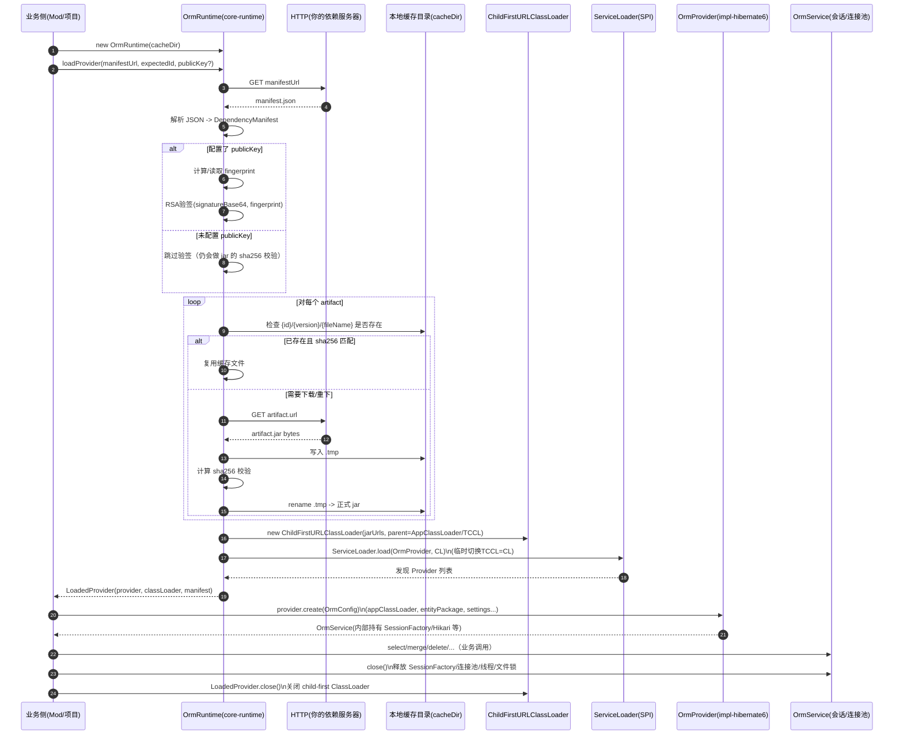

# OrmRuntime 执行时序图（从 Mod 启动到关闭）

下面这个时序图描述的是 **“隔离/按需下载模式”** 的完整执行链路：

- 业务侧（你的 Forge Mod）只依赖 `orm-core-*`
- provider（例如 Hibernate6）由 runtime 通过 manifest 下载并用 child-first ClassLoader 加载
- 业务侧创建 `OrmService` 后负责业务调用，停服时必须 close

## 关闭顺序（非常重要）

1. 先 `OrmService.close()`：释放 Hibernate SessionFactory、连接池线程、SQLite 文件锁等。
2. 再 `LoadedProvider.close()`：释放 child-first ClassLoader（防止类/资源句柄泄漏）。

